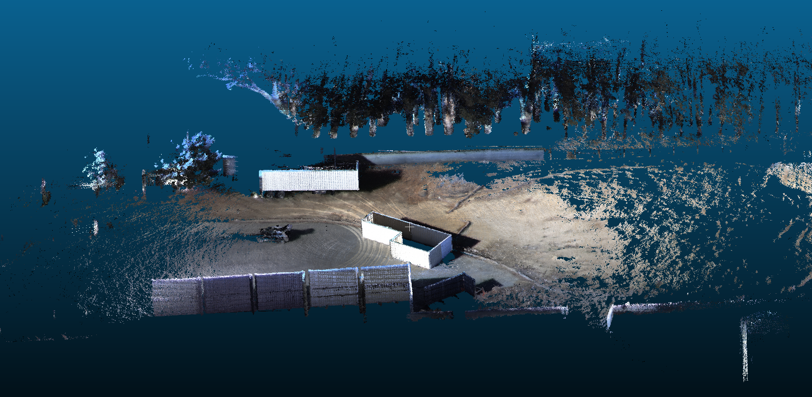
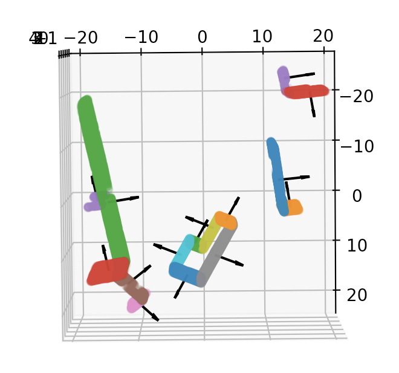
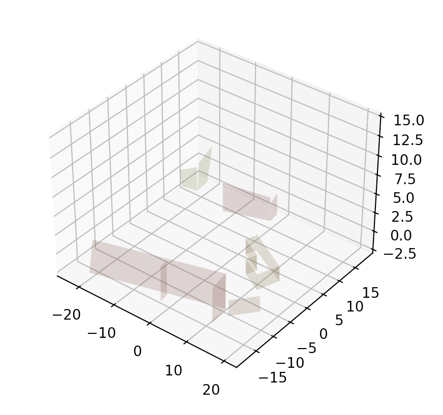
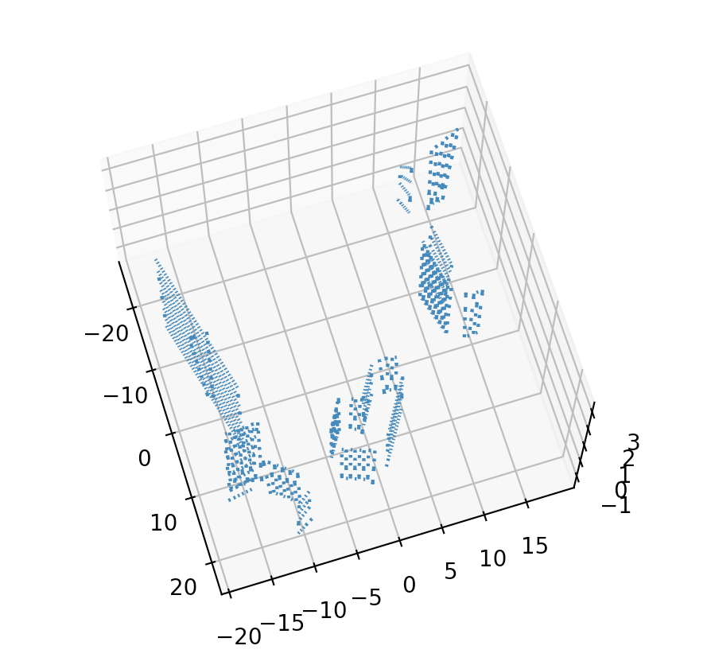

# ISAACS 2.5D / 3D Research Project

## Overview

### Problem Overview
The ISAACS 2.5D / 3D project's goal is to autonomously detect radiation sources within shipping containers, which is a necessary step in effectively screening international container traffic and regulating trade.

To find the radiation source(s), an autonomous drone is flown along the mission's waypoint path to collect radiation data. The drone then iteratively rules out potential source locations by using the AdaSearch algorithm, which is described in more detail in [A Successive-Elimination Approach to Adaptive Robotic Sensing](https://arxiv.org/abs/1809.10611). 

This repository contains code to plan the waypoint path when given the environment's point cloud data (which is gathered upstream by the drone). The waypoints are algorithmically computed by generating raster paths over the surfaces of every shipping container found within the point cloud. 

### Example Images

<p align="center">
  
</p>

<p align="center">
  &nbsp;&nbsp;&nbsp;
  &nbsp;&nbsp;&nbsp;
  
</p>
<p align="center">
  Example container extraction, surface reconstruction, and path generation from the point cloud data
</div>

## Getting Started

### Setup 

#### 1. Install pip requirements
```shell
pip3 install -r requirements.txt
```

#### 2. Set file paths
You can set the path to the input point cloud file (must be a .ply file) and the path to the output waypoints path (must be a .pkl file) by running
```shell
python3 set_paths.py -in [path to point cloud file] -out [path to output waypoints path]
```

### Running the path planner

#### 3. Execution
```shell
python3 container_extraction.py [--verbose] [--graph]
```
The flags specify whether you want the planner to print out debugging statements and if you want to graph the container extraction, surface reconstruction, and path generation.

## End-to-end testing with MAVROS Drone and ISAACS Server

### Setup

To set up the end-to-end testing framework with the ISAACS server, we must install the following dependencies. It is recommended to use either Ubuntu 16.04 or 18.04.

#### 1. Set up the ISAACS server (instructions [here](https://github.com/immersive-command-system/isaacs_server))

#### 2. Set up automated onboarding, connection, and communication of the MAVROS drone with ISAACS server (instructions [here](https://github.com/immersive-command-system/drone-mavros))

### Putting it all together

Once everything is installed, run the following commands in sequential order.

#### 3. Launch the Gazebo world
```shell
gazebo --verbose worlds/typhoon_ardupilot.world 
```

#### 4. Start the SITL Simulation
In the installed `ardupilot` directory, run
```shell
python3 Tools/autotest/sim_vehicle.py -v ArduCopter -f gazebo-iris
```

#### 5. Start the ISAACS server
```shell
roslaunch rosbridge_server rosbridge_websocket.launch
```

#### 6. Run the Operator node
In the installed `isaacs_server` directory, run
```shell
python3 src/operator.py --ip localhost
```

#### 7. Launch the MAVROS drone and connect with the ISAACS server
In the `drone-mavros` directory, run
```shell
roslaunch server_connector src/server_connector/launch/start_connection.launch server_ip:=localhost
```

#### 8. Run AdaSearch flight algorithm
```shell
python3 isaacs_server_interface.py
```
