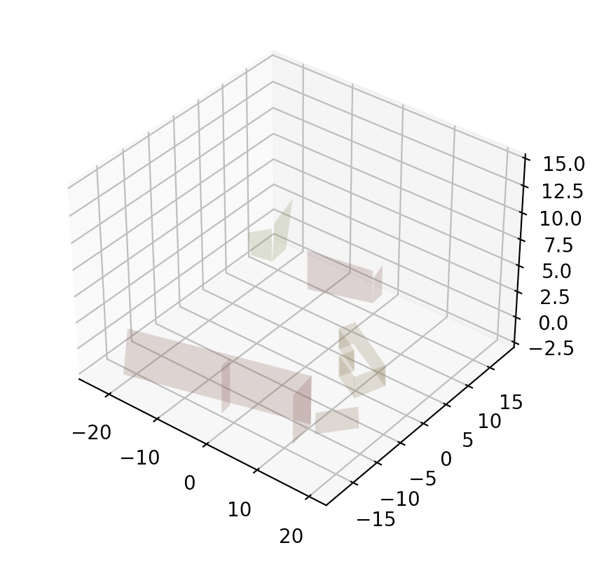

# ISAACS 2.5D / 3D Research Project

## Overview

### Problem Overview
The ISAACS 2.5D / 3D project's goal is to autonomously detect radiation sources within shipping containers, which is a necessary step in effectively screening international container traffic and regulating trade.

To find the radiation source(s), an autonomous drone is flown along the mission's waypoint path to collect radiation data. The drone then iteratively rules out potential source locations by using the AdaSearch algorithm, which is described in more detail in [A Successive-Elimination Approach to Adaptive Robotic Sensing](https://arxiv.org/abs/1809.10611). 

This repository contains code to plan the waypoint path when given the environment's point cloud data (which is gathered upstream by the drone). The waypoints are algorithmically computed by generating raster paths over the surfaces of every shipping container found within the point cloud. 

### Example Images

<p align="center">
  
</p>

<p align="center">
  &nbsp;&nbsp;&nbsp;
  &nbsp;&nbsp;&nbsp;
  
</p>
<p align="center">
  Example container extraction, surface reconstruction, and path generation from the point cloud data
</div>

## Getting Started

### Setup 

#### 1. Install pip requirements
`pip3 install -r requirements.txt`

#### 2. Set file paths
You can set the path to the input point cloud file (must be a .ply file) and the path to the output waypoints path (must be a .pkl file) by running
`python3 set_paths.py -in [path to point cloud file] -out [path to output waypoints path]`

### Running the path planner

#### 3. Execution
`python3 container_extraction.py [--verbose] [--graph]`
The flags specify whether you want the planner to print out debugging statements and if you want to graph the container extraction, surface reconstruction, and path generation.

### End-to-end Testing with MAVROS Drone and ISAACS Server

To set up the end-to-end testing framework with the ISAACS server, we must install the following dependencies. It is recommended to use either Ubuntu 16.04 or 18.04.

#### 1. Set up the ISAACS Server
Follow the installation guidelines [here](https://github.com/immersive-command-system/isaacs_server)

#### 2. Set up automated onboarding, connection, and communication of MAVROS Drone with ISAACS Server
Follow the installation guidelines [here](https://github.com/immersive-command-system/drone-mavros).

#### 3. End-to-end testing
Once everything is installed, run the following commands in sequential order.
1. `gazebo --verbose worlds/typhoon_ardupilot.world `
2. In ```.../ardupilot/ArduCopter```, run ` python3 ../Tools/autotest/sim_vehicle.py -v ArduCopter -f gazebo-iris`
3. `roslaunch rosbridge_server rosbridge_websocket.launch`
4. In ```.../isaacs_server/src```, run `python3 operator.py --ip localhost`
5. In ```.../drone-mavros/src/server_connector/launch```, run `roslaunch server_connector start_connection.launch server_ip:=localhost`
6. Finally, run `python3 isaacs_server_interface.py`
